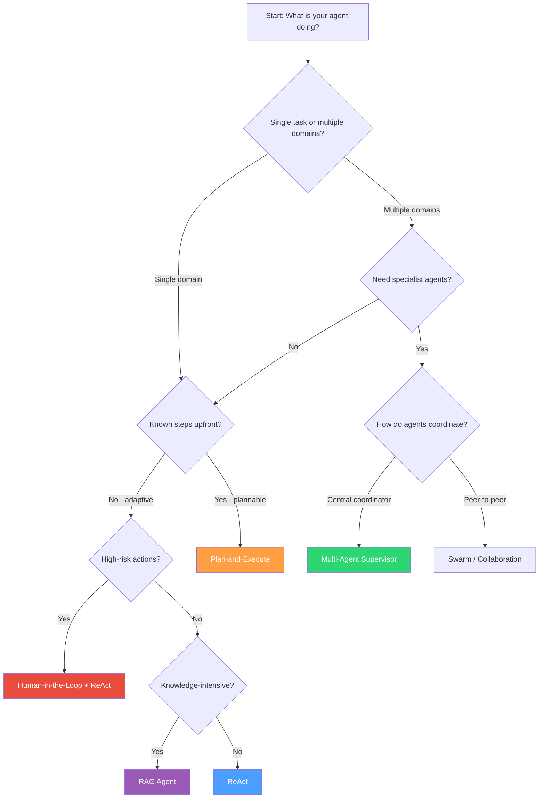
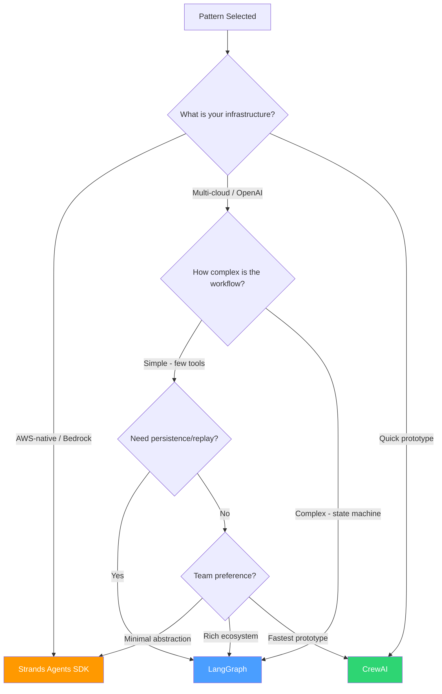

# Decision Tree: Choosing the Right Pattern and Framework

## Part 1: Selecting the Pattern

Use this decision tree to identify which agentic pattern fits your use case.

## Part 2: Pattern Selection Quick Reference

| Question | If Yes | If No |
|----------|--------|-------|
| Is the task a single well-defined action? | ReAct | Continue... |
| Do you need to search documents for answers? | RAG Agent | Continue... |
| Are there irreversible/high-stakes actions? | Human-in-the-Loop | Continue... |
| Can you decompose into ordered steps upfront? | Plan-and-Execute | Continue... |
| Do you need different expertise for sub-tasks? | Multi-Agent Supervisor | ReAct |

## Part 3: Selecting the Framework

Once you have chosen a pattern, use this matrix to select the framework.

## Part 4: Framework Selection by Constraint

| Constraint | Recommended Framework | Reasoning |
|------------|----------------------|-----------|
| Must use AWS Bedrock | Strands Agents | Native integration, no adapter |
| Need checkpoint/resume | LangGraph | First-class persistence support |
| Must ship in 1 week | CrewAI | Fastest time to working code |
| Complex state transitions | LangGraph | Explicit graph with conditional edges |
| Team knows Python, not frameworks | Strands Agents | Imperative, minimal magic |
| Need LangSmith observability | LangGraph | Native LangSmith integration |
| Multi-agent with roles | CrewAI | Built for role-based agents |
| Regulated industry (audit trail) | LangGraph | Checkpointer provides full replay |
| Serverless deployment (Lambda) | Strands Agents | AWS-native, lightweight |
| Need streaming responses | LangGraph or Strands | Both have strong streaming support |

## Part 5: Combining Patterns

Patterns are composable. Common combinations:

| Combination | Use Case |
|-------------|----------|
| Supervisor + ReAct | Each specialist uses ReAct internally |
| Plan-and-Execute + HITL | Human approves the plan before execution |
| RAG + ReAct | Agent retrieves then reasons with context |
| Supervisor + HITL | Supervisor routes, high-risk specialists require approval |
| Plan-and-Execute + RAG | Planner queries KB to inform the plan |

## Anti-Patterns to Avoid

1. **Over-decomposition**: Using multi-agent when one agent with tools would suffice. The overhead of coordination is only worth it when domains are truly distinct.

2. **Plan-and-Execute for simple tasks**: If the task is 1-2 steps, the planning overhead adds latency without benefit. Use ReAct instead.

3. **HITL everywhere**: If every action requires approval, the agent provides no autonomy benefit. Reserve HITL for genuinely high-risk operations.

4. **RAG without evaluation**: Retrieving documents without checking relevance leads to hallucination-on-context. Always evaluate retrieved chunks.

5. **Framework lock-in**: Design your tools and domain logic independently of the framework. The orchestration layer should be replaceable.
